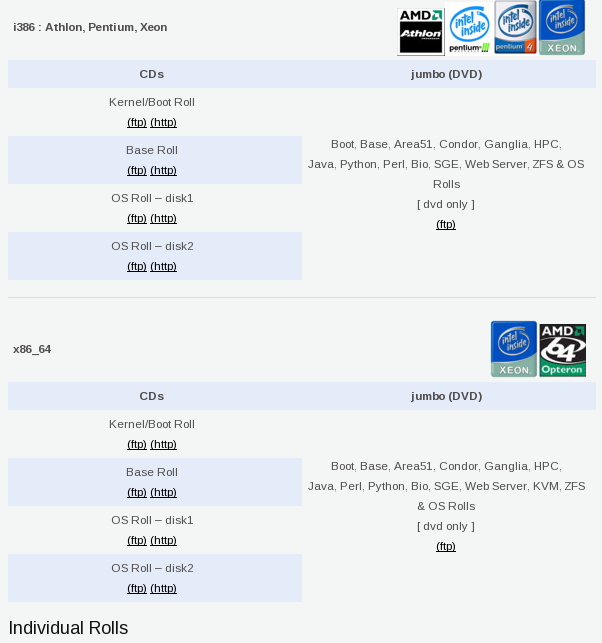

..	This file/document is beyond the scope of this tutorial and should be
	removed.

Setting Up Your Frontend
************************
In this section you will learn where to **download** the most up-to-date version of Rocks and **install** it on your frontend.

Downloading Rocks
=================
The current and past releases of Rocks will be found here:

`Rocks Releases <http://www.rocksclusters.org/wordpress/?page_id=80>`_

Choose the version of Rocks to install.

.. figure:: images/1Download_Rocks_Cropped.png
   :align:  center

   *The download page on the Rocks Website*

Download the individual rolls you will need or simply download the **jumbo roll** which has been created to contain a few general rolls for your convenience.  *(jumbo roll contains: Boot, Base, Area51, Condor, Ganglia, HPC, Java, Perl, Python, Bio, SGE, Web Server, KVM (on the x86_64 version), ZFS & OS Rolls)* Burn the ISO to a disc or any other bootable media.

It is recommended that you install at least the following rolls: *Boot, Base, Area51, Ganglia, HPC, Java, Perl, Python, Bio, and SGE*

   *The jumbo roll is located on the right*

Installing Rocks
================
Be aware that when the Rocks Installation boots, if you do not press any button the ``build`` command will automatically run without clarification of any of the options (you will be able to fill the options in during the installtion, but it is easier to input them as options of ``build``).  Boot to the media and do the ``build`` command::

   build IP=192.168.117.5 netmask=255.255.255.128 dns=198.202.75.26 gateway=192.168.117.1

   *The IP address is applied to the eth1 port*

Continue to follow the instructions presented to you as it asks for the name of the machine and the password for the **root user**.  Installation may take up to **20 minutes**.  Please note that if the system posts but does not boot after installation, the node may be do to a hardware failure.
