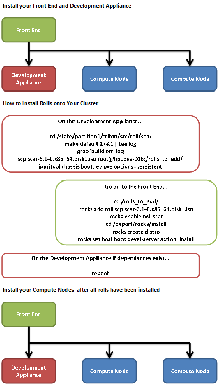

.. Rocks_Documentation documentation master file, created by sphinx-quickstart on Tue Feb  5 14:03:20 2013.  You can adapt this file completely to your liking, but it should at least contain the root `toctree` directive.                 

Welcome to Rocks Documentation!
*******************************

Table of Contents

`Setting Up Your Front End <https://github.com/sdsc/cluster-guide/blob/master/FrontEnd.rst>`_

`Using SSH Keys https://github.com/sdsc/cluster-guide/blob/master/SSHkeys.rst`_

`Installing Your Development Appliance https://github.com/sdsc/cluster-guide/blob/master/FrontEnd.rst`_

`Installing Rocks Rolls https://github.com/sdsc/cluster-guide/blob/master/FrontEnd.rst`_

`Testing Your Roll Installations https://github.com/sdsc/cluster-guide/blob/master/FrontEnd.rst`_

`Reinstalling Your Development Appliance https://github.com/sdsc/cluster-guide/blob/master/FrontEnd.rst`_

`Installing Your Compute Nodes https://github.com/sdsc/cluster-guide/blob/master/FrontEnd.rst`_

Overview of Rocks Documentation
===============================
In this documentation you will learn how to install the latest version of Rocks while building your Front End and its nodes..  While doing this you will create the roll distrobution for your nodes on your Front End.  This process is briefly shown in the below flow chart.

   *This is the basic overview of what you will be doing in this tutorial.*

The official and length version of the Rocks Installation can be found at the link below.

`Official Rocks Documentation <http://www.rocksclusters.org/rocks-documentation/4.1/getting-started.html>`_

   *A link to the Rocks Cluster Distribution: Users Guide*