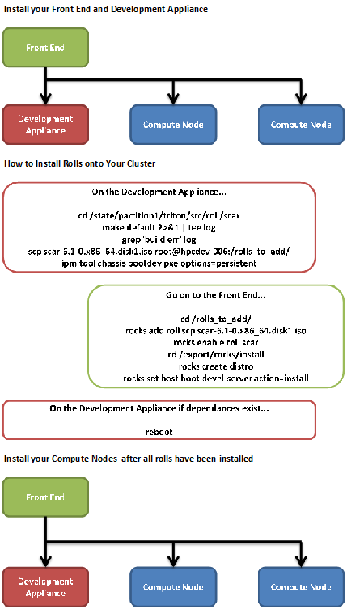

.. Rocks_Documentation documentation master file, created by sphinx-quickstart on Tue Feb  5 14:03:20 2013.  You can adapt this file completely to your liking, but it should at least contain the root `toctree` directive.                 

Welcome to Rocks Documentation!
*******************************

..	The 'title' of this document is very misleading. The purpose of this
	document is NOT to provide documentation for Rocks. It is to provide
	documentation for using the Triton roll(s) on a Rocks cluster. The
	document title should be renamed.

..	In addition, the README.rst file should probably only POINT to the
	Triton roll guide (for lack of a better name) and can/should include
	links to other pertinent parts of the SDSC Triton Roll repository
	contents.

..	The specific layout of the SDSC Triton Roll repository contents and the
	entire SDSC GitHub repository collection should be considered to decide
	where this document 'fits'.

Table of Contents

.. reStructuredText, aka reST or .rst, provides built-in creation of a 'dynamic' TOC from section/sub-section/etc directives. Is there a specific reason why this 

..	Add `Overview` to the TOC

- `Setting Up Your Front End <https://github.com/sdsc/cluster-guide/blob/master/FrontEnd.rst>`_
- `Using SSH Keys <https://github.com/sdsc/cluster-guide/blob/master/SSHkeys.rst>`_

..	Arguably, the preceding two items are beyond the scope of this document.

- `Installing Your Development Appliance <https://github.com/sdsc/cluster-guide/blob/master/InstallingDevel.rst>`_

..	The preceding item, while pertinent to this tutorial, need not go into
	the level of detail that it does. The specifics of installing a node are
	covered in the Rocks User Guide.

- `Installing Rocks Rolls <https://github.com/sdsc/cluster-guide/blob/master/InstallingRolls.rst>`_

..	This is the meat of the tutorial and could (should?) be broken up into
	smaller sections.

- `Testing Your Roll Installations <https://github.com/sdsc/cluster-guide/blob/master/RollTests.rst>`_

..	Arguably, this preceding section should be a subsection of `Installing
	Rocks Rolls`

- `Reinstalling Your Development Appliance <https://github.com/sdsc/cluster-guide/blob/master/ReinstallingDevel.rst>`_

Overview of Rocks Documentation
===============================
In this documentation you will learn how to install the latest version of Rocks while building your Front End and its nodes..  While doing this you will create the roll distrobution for your nodes on your Front End.  This process is briefly shown in the below flow chart.

   *This is the basic overview of what you will be doing in this tutorial.*

The official and length version of the Rocks Installation can be found at the link below.

`Official Rocks Documentation <http://www.rocksclusters.org/rocks-documentation/4.1/getting-started.html>`_

   *A link to the Rocks Cluster Distribution: Users Guide*
   
..	As mentioned previously, this documentation SHOULD NOT be 'how to
	install Rocks' but should pick up AFTER the frontend is installed. Listed
	in the Overview should be the goal and assumptions of THIS documentation.
	
..	The target audience could (should?) also be mentioned in the Overview.

..	The division of this document into multiple pages may not be necessary.