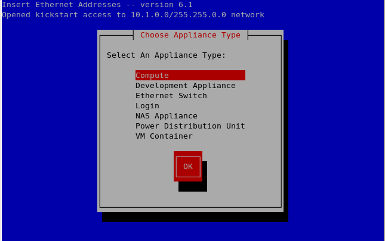
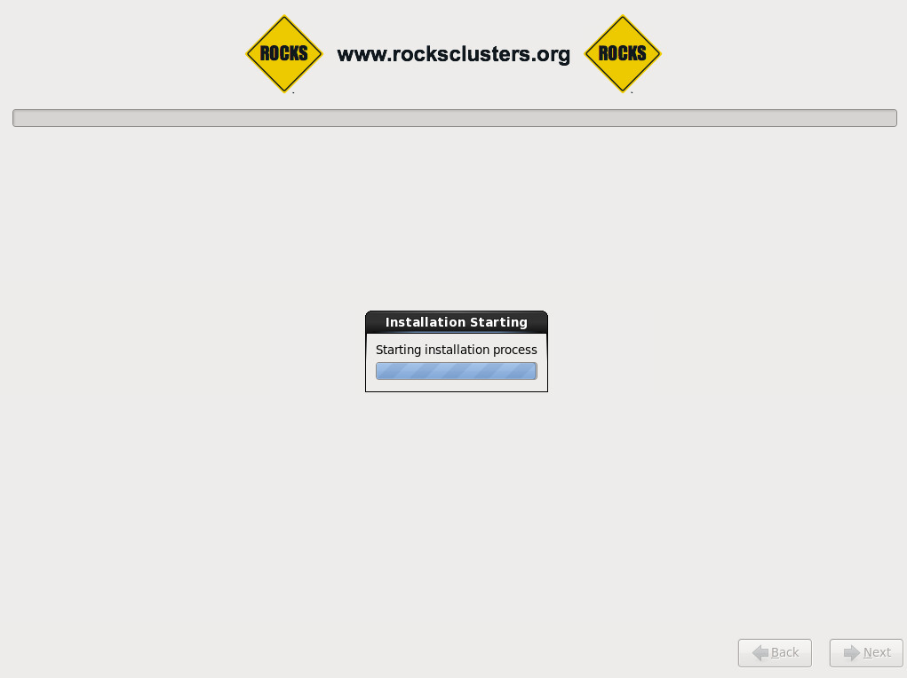

Installing Your Compute Nodes
=============================
Open up a terminal on your front end and do the following command::

   insert-ethers

The screen below will then pop up on your terminal:

   *The interface for the insert-ethers command*

Select to install a Compute Node.  Now turn on the desired nodes and wait until the nodes are detected.  Multiple nodes can be installed at the same time.  When a node is detected you will see the mac address of the node in the *Inserted Appliances* window shown below.

.. figure:: images/4node_discovered_Cropped.png
   :align:  center

   *Each computer will pop up individually each with their mac address and host name*

In order to prevent risk of corrupted hardware, do **not** exit this terminal until it is safe to do so (this is explained later in this tutorial).  When a node is installing you can check its progress by using the command::

   rocks console compute-0-0

*This brings up the window in the picture below*

If you need to look up the **hostnames** of your nodes then use the command::

   rocks list host

*The hostnames are in the first column*

   *This is the process of the installation of the nodes shown through rocks console*

You will not be able to use the ``rocks console`` command once the installation is done, but at that point you will be able to simply ``ssh`` into it.  When *s appear between all of the *()s* you may press the *f8* key to quit the GUI without interupting the installation.

.. figure:: images/6f8_okay_Cropped.png
   :align:  center

   *Notice the appearance of the **

If you would like to install nodes of a different appliance type repeat the process from `Installing Your Appliance Nodes`_.  Once the installation of your node(s) is complete test if you can ``ping`` and ``ssh`` into all of your nodes::

   ping compute-0-0
   ssh compute-0-0
